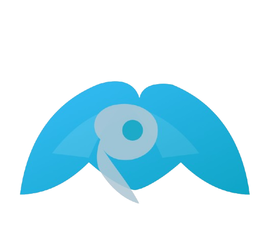

<div align="center">
	
  
	             Mara | مَرَا
	AI‑powered personal health assistant** delivering safe, multilingual and privacy‑aware medical insights.
	
	 Mobile App (Flutter) · FastAPI Backend · Firebase · RevenueCat · AI Inference 
</div>

=======
---

## Overview
Mara combines a Flutter mobile client with a Python (FastAPI) backend that mediates authentication, usage quotas, multilingual processing, AI reasoning, and (future) record/file analysis. Subscriptions & entitlements are handled through RevenueCat; authentication and basic user metadata through Firebase. PostgreSQL (via Supabase) or future storage layers can back persistent analytics and usage.

---

## 🚀 Vision & Mission
- **Mission**: Revolutionize healthcare by making safe, multilingual AI health guidance accessible to everyone.  
- **Vision**: Become the leading AI-powered health platform in the MENA region and beyond, bridging the gap between preventive health and personalized care.

---

## Project Structure
```
.
├── backend/                 # FastAPI service (API, auth, translation, AI calls)
│   ├── app/
│   │   ├── main.py          # FastAPI entrypoints & routes
│   │   ├── auth.py          # Firebase token verification
│   │   ├── config.py        # Settings (env-driven)
│   │   ├── mara_client.py   # ask_mara_doctor() abstraction
│   │   ├── translate.py     # Language detection & translation helpers
│   │   └── usage_store.py   # Simple in-memory / placeholder usage tracking
│   ├── requirements.txt
│   └── gunicorn_conf.py
├── marafinal/               # Flutter app root
│   ├── lib/
│   │   ├── main.dart
│   │   ├── splash_screen.dart
│   │   ├── auth_gate.dart
│   │   └── firebase_options.dart
│   ├── assets/              # Logos & images
│   ├── android/             # Android build config
│   ├── ios/                 # iOS project
│   ├── pubspec.yaml
│   └── test/
├── serviceAccount.json (optional local dev Firebase creds)
└── README.md (you are here)
```

## ✨ Core Features
- AI medical Q&A (contextual, multilingual)
- Automatic language detection & translation pipeline
- Usage quotas (daily free messages & character limits)
- Secure auth: Email / Google / Apple via Firebase
- Subscription & entitlement management (RevenueCat)
- Planned: File / lab report analysis, health device integrations, smart mirror offline mode

## 🛠 Tech Stack
| Layer        | Technology |
|--------------|------------|
| Mobile       | Flutter (Dart) |
| Backend API  | FastAPI + Uvicorn/Gunicorn |
| AI Models    | OpenAI / Hugging Face inference (configurable) |
| Auth         | Firebase Auth |
| Payments     | RevenueCat |
| Data / Future| PostgreSQL (Supabase) |
| Infra (future)| Docker, Cloudflare Workers / Edge |

---

## 📊 Market Opportunity
- **TAM**: $23B  
- **SAM**: $290M  
- **SOM**: $25M  

---

## 🧩 Problem We Solve
- Lack of proactive health monitoring at home.  
- Fragmented user experience (multiple apps for different health aspects).  
- Mental health often overlooked.  
- 70% of chronic diseases could be prevented with early detection (WHO).  
- 1 in 4 people globally will experience a mental health condition in their lifetime (WHO).  

---

## 🏆 Unique Value Proposition
- First in the region to integrate **AI health advice with lifestyle management**.  
- Simple, accessible, and compliant with local & global regulations.  
- A trusted path from **self-check to professional care**.  

---

## 🥊 Competitor Analysis
| Competitor   | Strengths | Weaknesses |
|--------------|-----------|------------|
| Apple Health | Strong ecosystem, iPhone/Watch integration | Requires wearables, no deep emotion analysis |
| Google Fit   | Broad Android integration, activity & vitals tracking | Basic mental health tracking, no facial/emotion recognition |
| Fitbit App   | Good fitness & sleep tracking | Needs dedicated hardware, lacks AI-driven insights |
| ChatGPT      | Strong conversational AI adaptable to health | Not specialized for preventive health monitoring |

---

## 🔐 Authentication & Authorization
Clients send a Firebase ID token as a Bearer token. Verification can be disabled for local development with `VERIFY_ID_TOKEN=false` (not recommended in production). Entitlement / subscription state is expected to be checked client‑side (RevenueCat) and optionally asserted server‑side in future versions.


## 📡 API Summary (Current)
| Method | Path              | Description                              | Auth |
|--------|-------------------|------------------------------------------|------|
| GET    | /healthz          | Liveness/env check                       | No   |
| GET    | /usage            | Returns daily count & limits             | Yes  |
| POST   | /chat             | Ask Mara (message, optional lang)        | Yes  |
| POST   | /files/analyze    | Placeholder for file URL analysis        | Yes  |

Example `POST /chat` body:
```json
{ "message": "Tengo dolor de cabeza y fiebre", "lang": "es" }
```
Response (simplified):
```json
{ "reply": "...", "source_lang": "es", "usage_left": 7 }
```

## 💰 Business Model
	•	Free: Up to 10 daily messages, simple analytics.
	•	Monthly (SAR10): Unlimited messages + full analytics.
	•	Annual (SAR100): Unlimited messages + full suite.
>>>>>>> 40c7afd (docs: add governance, security, threat model, and architecture docs; update README and License)


<<<<<<< HEAD
---

## Permission Grant
=======
## 📈 Traction
	•	Prototype ready, first MVP of Mara app.
	•	200+ early access signups.
	•	+2,000 unique visitors on Mara landing page.
>>>>>>> 40c7afd (docs: add governance, security, threat model, and architecture docs; update README and License)

Permission is hereby granted, free of charge, to any person obtaining a copy of this software and its associated documentation files (the “Software”), to:

<<<<<<< HEAD
- Use the Software for personal and non-commercial purposes.  
- Copy and install the Software on supported devices.  
- Modify the Software strictly for **personal, non-commercial use**.  
- Merge the Software into other applications only when such use complies with this License.  
- Publish or distribute the Software **solely through Mara’s official distribution channels**.  
- Sublicense only with the **prior written consent of the Mara founding team**.  
- Sell copies or derivative works **only with an explicit, signed commercial agreement** with Mara.  

---

## 1. Official Distribution Only
- The Software may **only** be downloaded, installed, or obtained through Mara’s official distribution channels.  
- Official channels include:  
  - The official website: [iammara.com](https://iammara.com)  
  - The Apple App Store  
  - The Google Play Store  
  - Any other platforms explicitly designated by the Mara founding team  
- Redistribution through any third-party websites, torrents, peer-to-peer services, or unofficial app stores is **strictly prohibited**.  

---

## 2. Commercial Use Restrictions
- No person, company, or organization may:  
  - Monetize the Software directly.  
  - Sell access to the Software.  
  - Bundle the Software with paid products.  
  - Offer Software-as-a-Service built upon Mara.  
- All commercial rights are reserved exclusively by Mara.  
- Exceptions may only be granted by **written approval** from Mara’s founding team.  

---

## 3. Attribution Requirement
- The copyright notice and this permission notice **must** be included in:  
  - All copies of the Software.  
  - Any substantial portions of the Software.  
- Removal or modification of copyright or attribution notices is **strictly forbidden**.  

---

## 4. Integrity of Use
- Users may not remove, alter, or obscure:  
  - Logos  
  - Trademarks  
  - Attribution notices  
  - Security notices  
- Any modification that misrepresents the origin of the Software as being from another entity is prohibited.  

---

## 5. Security & Privacy
- The Software is designed to prioritize **data security** and **user privacy**.  
- Users may not attempt to:  
  - Reverse-engineer encryption.  
  - Interfere with secure communication.  
  - Access or exfiltrate private data.  
- Any breach of these terms may result in legal action under applicable cybersecurity and privacy laws.  

---

## 6. Prohibited Uses
The following are **strictly prohibited** without explicit written authorization:  

1. **Reverse Engineering**  
   - Decompiling, disassembling, or analyzing source code.  

2. **Unauthorized Cloning**  
   - Creating duplicates of the Software for public distribution.  

3. **Repackaging**  
   - Releasing modified builds under another name or brand.  

4. **Unauthorized AI Training**  
   - Using Mara’s datasets, responses, or algorithms to train other models.  

5. **Trademark Violations**  
   - Using the Mara name, logo, or visual identity in unrelated projects.  

---

## 7. Trademarks
- “Mara,” “Mara Doctor,” the Mara logo, and related marks are **registered or unregistered trademarks** of the founders.  
- No right, license, or permission is granted to use these marks without prior written consent.  
- Unauthorized use may result in trademark infringement proceedings.  

---

## 8. Compliance with Laws
- Users must comply with all local, regional, and international laws when using the Software.  
- This includes:  
  - Data protection laws (e.g., GDPR, Saudi PDPL).  
  - Healthcare data regulations.  
  - Export control laws.  

---

## 9. Updates & Modifications
- Mara reserves the right to:  
  - Issue updates, patches, or security fixes.  
  - Disable outdated or unauthorized versions.  
  - Terminate access to non-compliant users.  

---

## 10. Disclaimer of Warranty
THE SOFTWARE IS PROVIDED “AS IS,” WITHOUT WARRANTY OF ANY KIND, EXPRESS OR IMPLIED, INCLUDING BUT NOT LIMITED TO:  

- Warranties of merchantability  
- Fitness for a particular purpose  
- Non-infringement  

In no event shall the authors or copyright holders be liable for:  

- Claims  
- Damages  
- Liabilities  
- Loss of data  
- Security breaches  
- Or any other issues arising from use of the Software  

---

## 11. Limitation of Liability
- Users assume full responsibility for how they use the Software.  
- Mara shall not be liable for:  
  - Direct damages  
  - Indirect damages  
  - Consequential damages  
  - Loss of profits or data  
- Even if Mara has been advised of the possibility of such damages.  

---

## 12. Enforcement
- Any violation of this License may result in:  
  - Immediate revocation of usage rights.  
  - Account termination.  
  - Legal proceedings.  

---

## 13. Governing Law
- This License shall be governed by the laws of the Kingdom of Saudi Arabia.  
- Legal disputes shall be settled in Riyadh courts unless otherwise agreed in writing.  

---

## 14. Future Amendments
- Mara reserves the right to update this License at any time.  
- Continued use of the Software constitutes agreement to the latest version.  

---

## 15. Acceptance
By installing, downloading, or using Mara, you acknowledge that you:  

- Have read this License.  
- Understand its terms.  
- Agree to be bound by all its conditions.  

---

## Additional Notes
- Unauthorized cloning, reverse engineering, or repackaging of this Software for any purpose is strictly prohibited.  
- The Mara name, brand, and logo are trademarks of the founders and may not be used without explicit written consent.  
- By using this Software, you agree to abide by the above conditions and acknowledge that violations may result in **legal action**.  

---
=======
## 🤝 Social Impact & SDGs
	-	Affordable health access for students and underserved communities.
	-	Promoting preventive healthcare and digital literacy.
	-	Encouraging healthier lifestyles via reminders & tracking.
	-	Supports UN Goals:
	-	SDG 3: Good Health & Well-Being
	-	SDG 4: Quality Education
	-	SDG 9: Innovation & Infrastructure

⸻

## ⚠️ Challenges
	-	Compliance with strict data privacy laws.
	-	Access to diverse, high-quality medical datasets.
	-	Small team & limited resources.

⸻
## Where to find us :)
- [Linkedin](https://www.linkedin.com/company/yourmara/)
- [Discord](https://discord.com/invite/hVxvU4ekhJ)
- [Instagram](https://www.instagram.com/iamurmara)
- [Tiktok](https://www.tiktok.com/@iamurmara)
- [x](https://x.com/iamurmara)
- [Email](mailto:support@iammara.com?subject=Support%20Request)


## 📜 License
This project is strictly proprietary.  
See [License.md](./License.md) for full legal terms.

## 👥 Team
- [Abdulaziz Alkhlaiwe](https://www.linkedin.com/in/abdulaziz-alkhlaiwe/) – Co-Founder, CEO / abdulaziz.alkhlaiwe@iammara.com
- [Omar Al Sumih](https://www.linkedin.com/in/omar-alsumih/) - Co-Founder, CTO / omaralsumih@iammara.com
- [Muhanned Almuwayhi](https://www.linkedin.com/in/muhannad-almuwayhi-b55547293/) - Co-Founder, CFO / muhannad.almuwayhi@iammara.com

## 📬 Contact
Website: https://www.iammara.com
Email: contact@iammara.com

---
Made with ❤️ to make health knowledge more accessible.
>>>>>>> 40c7afd (docs: add governance, security, threat model, and architecture docs; update README and License)
