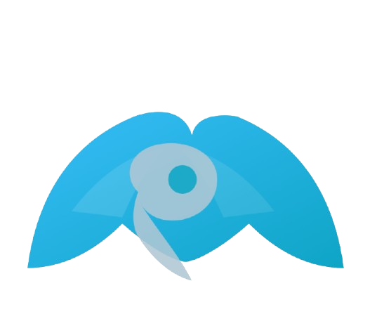

<div align="center">
	
  
	             Mara | مَرَا
	AI‑powered personal health assistant** delivering safe, multilingual and privacy‑aware medical insights.
	
	 Mobile App (Flutter) · FastAPI Backend · Firebase · RevenueCat · AI Inference 
</div>

---

## Overview
Mara combines a Flutter mobile client with a Python (FastAPI) backend that mediates authentication, usage quotas, multilingual processing, AI reasoning, and (future) record/file analysis. Subscriptions & entitlements are handled through RevenueCat; authentication and basic user metadata through Firebase. PostgreSQL (via Supabase) or future storage layers can back persistent analytics and usage.

---

## 🚀 Vision & Mission
- **Mission**: Revolutionize healthcare by making safe, multilingual AI health guidance accessible to everyone.  
- **Vision**: Become the leading AI-powered health platform in the MENA region and beyond, bridging the gap between preventive health and personalized care.

---

## Project Structure
```
.
├── backend/                 # FastAPI service (API, auth, translation, AI calls)
│   ├── app/
│   │   ├── main.py          # FastAPI entrypoints & routes
│   │   ├── auth.py          # Firebase token verification
│   │   ├── config.py        # Settings (env-driven)
│   │   ├── mara_client.py   # ask_mara_doctor() abstraction
│   │   ├── translate.py     # Language detection & translation helpers
│   │   └── usage_store.py   # Simple in-memory / placeholder usage tracking
│   ├── requirements.txt
│   └── gunicorn_conf.py
├── marafinal/               # Flutter app root
│   ├── lib/
│   │   ├── main.dart
│   │   ├── splash_screen.dart
│   │   ├── auth_gate.dart
│   │   └── firebase_options.dart
│   ├── assets/              # Logos & images
│   ├── android/             # Android build config
│   ├── ios/                 # iOS project
│   ├── pubspec.yaml
│   └── test/
├── serviceAccount.json (optional local dev Firebase creds)
└── README.md (you are here)
```

## ✨ Core Features
- AI medical Q&A (contextual, multilingual)
- Automatic language detection & translation pipeline
- Usage quotas (daily free messages & character limits)
- Secure auth: Email / Google / Apple via Firebase
- Subscription & entitlement management (RevenueCat)
- Planned: File / lab report analysis, health device integrations, smart mirror offline mode

## 🛠 Tech Stack
| Layer        | Technology |
|--------------|------------|
| Mobile       | Flutter (Dart) |
| Backend API  | FastAPI + Uvicorn/Gunicorn |
| AI Models    | OpenAI / Hugging Face inference (configurable) |
| Auth         | Firebase Auth |
| Payments     | RevenueCat |
| Data / Future| PostgreSQL (Supabase) |
| Infra (future)| Docker, Cloudflare Workers / Edge |

---

## 📊 Market Opportunity
- **TAM**: $23B  
- **SAM**: $290M  
- **SOM**: $25M  

---

## 🧩 Problem We Solve
- Lack of proactive health monitoring at home.  
- Fragmented user experience (multiple apps for different health aspects).  
- Mental health often overlooked.  
- 70% of chronic diseases could be prevented with early detection (WHO).  
- 1 in 4 people globally will experience a mental health condition in their lifetime (WHO).  

---

## 🏆 Unique Value Proposition
- First in the region to integrate **AI health advice with lifestyle management**.  
- Simple, accessible, and compliant with local & global regulations.  
- A trusted path from **self-check to professional care**.  

---

## 🥊 Competitor Analysis
| Competitor   | Strengths | Weaknesses |
|--------------|-----------|------------|
| Apple Health | Strong ecosystem, iPhone/Watch integration | Requires wearables, no deep emotion analysis |
| Google Fit   | Broad Android integration, activity & vitals tracking | Basic mental health tracking, no facial/emotion recognition |
| Fitbit App   | Good fitness & sleep tracking | Needs dedicated hardware, lacks AI-driven insights |
| ChatGPT      | Strong conversational AI adaptable to health | Not specialized for preventive health monitoring |

---

## 🔐 Authentication & Authorization
Clients send a Firebase ID token as a Bearer token. Verification can be disabled for local development with `VERIFY_ID_TOKEN=false` (not recommended in production). Entitlement / subscription state is expected to be checked client‑side (RevenueCat) and optionally asserted server‑side in future versions.

### Secrets and config

- Copy `.env.example` to `.env` and fill values for local backend.
- Flutter uses compile-time defines for secrets. Pass them with `--dart-define`, e.g.:
	- `--dart-define=REVENUECAT_APPLE_API_KEY=xxxx`
	- `--dart-define=FIREBASE_ANDROID_API_KEY=xxxx` and iOS equivalents.
- Pre-commit secret scan: enable by running
	- `git config core.hooksPath .githooks`
	- ensure scripts are executable: `chmod +x scripts/secret_scan.sh .githooks/pre-commit`

## 📡 API Summary (Current)
| Method | Path              | Description                              | Auth |
|--------|-------------------|------------------------------------------|------|
| GET    | /healthz          | Liveness/env check                       | No   |
| GET    | /usage            | Returns daily count & limits             | Yes  |
| POST   | /chat             | Ask Mara (message, optional lang)        | Yes  |
| POST   | /files/analyze    | Placeholder for file URL analysis        | Yes  |

Example `POST /chat` body:
```json
{ "message": "Tengo dolor de cabeza y fiebre", "lang": "es" }
```
Response (simplified):
```json
{ "reply": "...", "source_lang": "es", "usage_left": 7 }
```

## 💰 Business Model
	•	Free: Up to 10 daily messages, simple analytics.
	•	Monthly (SAR10): Unlimited messages + full analytics.
	•	Annual (SAR100): Unlimited messages + full suite.

⸻

## 📈 Traction
	•	Prototype ready, first MVP of Mara app.
	•	200+ early access signups.
	•	+2,000 unique visitors on Mara landing page.

⸻

## 🤝 Social Impact & SDGs
	-	Affordable health access for students and underserved communities.
	-	Promoting preventive healthcare and digital literacy.
	-	Encouraging healthier lifestyles via reminders & tracking.
	-	Supports UN Goals:
	-	SDG 3: Good Health & Well-Being
	-	SDG 4: Quality Education
	-	SDG 9: Innovation & Infrastructure

⸻

## ⚠️ Challenges
	-	Compliance with strict data privacy laws.
	-	Access to diverse, high-quality medical datasets.
	-	Small team & limited resources.

⸻
## Where to find us :)
- [Linkedin](https://www.linkedin.com/company/yourmara/)
- [Discord]([https://www.linkedin.com/in/omar-alsumih/](https://discord.com/invite/hVxvU4ekhJ))
- [Instagram](https://www.instagram.com/iamurmara)
- [Tiktok](https://www.tiktok.com/@iamurmara)
- [x](https://x.com/iamurmara)
- [Email](mailto:support@iammara.com?subject=Support%20Request)


## 📜 License
This project is strictly proprietary.  
See [License.md](./License.md) for full legal terms.

## 👥 Team
- [Abdulaziz Alkhlaiwe](https://www.linkedin.com/in/abdulaziz-alkhlaiwe/) – Co-Founder, CEO / abdulaziz.alkhlaiwe@iammara.com
- [Omar Al Sumih](https://www.linkedin.com/in/omar-alsumih/) - Co-Founder, CTO / omaralsumih@iammara.com
- [Muhanned Almuwayhi](https://www.linkedin.com/in/muhannad-almuwayhi-b55547293/) - Co-Founder, CFO / muhannad.almuwayhi@iammara.com

## 📬 Contact
Website: https://www.iammara.com
Email: contact@iammara.com

---
Made with ❤️ to make health knowledge more accessible.
